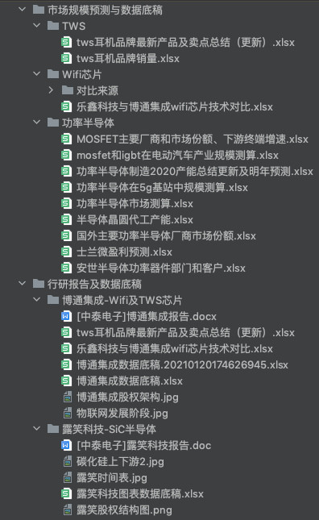

#过往行业研究报告及建模内容汇总：

一、简介：
------
您好！首先感谢您耐心阅读我的简历并看到这里！以下内容是我过往实习中关于行业研究报告撰写的内容，不涉及任何涉密内容。

###为何建立此作品集：
我并不擅长于吹捧自己，而过往实习中的学习经历和感受也并非三言两语可以厘清，我更多是想实实在在想告诉您我实习里做过什么而并非虚度时光，
因此我把过往实习中，由自己100%独立完成的内容均放入此文件夹。

###主要内容包括：

1，正式的行业研究报告及附带的数据底稿

2，行业内产品的技术指标对比及指标来源

3，行业的竞争格局，市场规模测算，增速预测，市场份额对比，盈利预测等。

4，过往日报的整理

二、目录：
------
## 第1-3项目录：

[1.市场规模预测与数据底稿](市场规模预测与数据底稿):

&#x2003; [1.1 TWS](市场规模预测与数据底稿/TWS)

&#x2003; &#x2003;[1.1.1 tws耳机品牌最新产品及卖点总结（更新）](市场规模预测与数据底稿/TWS/tws耳机品牌最新产品及卖点总结（更新）.xlsx)

&#x2003; &#x2003; [1.1.2 tws耳机品牌销量](市场规模预测与数据底稿/TWS/tws耳机品牌销量.xlsx)

&#x2003; [1.2 Wifi芯片](市场规模预测与数据底稿/Wifi芯片)

&#x2003; &#x2003; [1.2.1 乐鑫科技与博通集成wifi芯片技术对比](市场规模预测与数据底稿/Wifi芯片/乐鑫科技与博通集成wifi芯片技术对比.xlsx)

&#x2003; [1.3 功率半导体](市场规模预测与数据底稿/功率半导体)

&#x2003; &#x2003;[1.3.1 MOSFET主要厂商和市场份额、下游终端增速](市场规模预测与数据底稿/功率半导体/MOSFET主要厂商和市场份额、下游终端增速.xlsx)

&#x2003; &#x2003;[1.3.2 mosfet和igbt在电动汽车产业规模测算](市场规模预测与数据底稿/功率半导体/mosfet和igbt在电动汽车产业规模测算.xlsx)

&#x2003; &#x2003;[1.3.3 功率半导体制造2020产能总结更新及明年预测](市场规模预测与数据底稿/功率半导体/功率半导体制造2020产能总结更新及明年预测.xlsx)

&#x2003; &#x2003;[1.3.4 功率半导体在5g基站中规模测算](市场规模预测与数据底稿/功率半导体/功率半导体在5g基站中规模测算.xlsx)

&#x2003; &#x2003;[1.3.5 功率半导体市场测算](市场规模预测与数据底稿/功率半导体/功率半导体市场测算.xlsx)

&#x2003; &#x2003;[1.3.6 半导体晶圆代工产能](市场规模预测与数据底稿/功率半导体/半导体晶圆代工产能.xlsx)

&#x2003; &#x2003;[1.3.7 国外主要功率半导体厂商市场份额](市场规模预测与数据底稿/功率半导体/国外主要功率半导体厂商市场份额.xlsx)

&#x2003; &#x2003;[1.3.8 士兰微盈利预测](市场规模预测与数据底稿/功率半导体/士兰微盈利预测.xlsx)

&#x2003; &#x2003;[1.3.9 安世半导体功率器件部门和客户](市场规模预测与数据底稿/功率半导体/安世半导体功率器件部门和客户.xlsx)

[2 行研报告及数据底稿](行研报告及数据底稿)

&#x2003;[2.1 博通集成-Wifi及TWS芯片](行研报告及数据底稿/博通集成-Wifi及TWS芯片)

&#x2003; &#x2003;[2.1.1 博通集成研究报告](行研报告及数据底稿/博通集成-Wifi及TWS芯片/[中泰电子]博通集成报告.docx)

&#x2003; &#x2003;[2.1.2 博通集成数据底稿](行研报告及数据底稿/博通集成-Wifi及TWS芯片/博通集成数据底稿.20210120174626945.xlsx)

&#x2003;[2.2 露笑科技-SiC半导体](行研报告及数据底稿/露笑科技-SiC半导体)

&#x2003; &#x2003;[2.2.1 露笑科技报告](行研报告及数据底稿/露笑科技-SiC半导体/[中泰电子]露笑科技报告.doc)

&#x2003; &#x2003;[2.2.2 露笑科技图表数据底稿](行研报告及数据底稿/露笑科技-SiC半导体/露笑科技图表数据底稿.xlsx)

## 第4项目录
https://note.youdao.com/s/DqjVPuVg

https://note.youdao.com/s/WpKkLsA2

https://note.youdao.com/s/Db1jNF4v

https://note.youdao.com/s/WQobGALi

https://note.youdao.com/s/cdWlY4Tz

https://note.youdao.com/s/V2C9JL9x

https://note.youdao.com/s/K8KKqSE9

https://note.youdao.com/s/a2ErWHmi

https://note.youdao.com/s/UWpWLarG

https://note.youdao.com/s/JtQrgtmN

https://note.youdao.com/s/MAxSZyDQ

https://note.youdao.com/s/A3gUYIfj

https://note.youdao.com/s/cBqBhTSI

https://note.youdao.com/s/UqiCKDbP

https://note.youdao.com/s/8pyEwSVp

https://note.youdao.com/s/9fN8YqT4

https://note.youdao.com/s/XZ5kF0c4

https://note.youdao.com/s/G3Umaejp

https://note.youdao.com/s/FwAQ6vRa

https://note.youdao.com/s/LUe7igfu

https://note.youdao.com/s/3PadN0Bl

##其他：
Mosfet市场规模分拆：
https://note.youdao.com/s/JS5Lur9

Mosfet主要企业及下游市场增速：
https://note.youdao.com/s/aNKM7Ump

碳化硅半导体晶圆与器件市场概况：
https://note.youdao.com/s/KwlSRyyM

台积电设备及耗材收益公司：
https://note.youdao.com/s/PTmQyH2K

自学的《集成电路制作工艺》学习笔记：
https://note.youdao.com/s/N9a2mUTp
